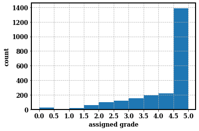

## Objective
 --------------------------------------------------------------------------------
  To evaluate the robustness of pretrained embeddings of the four transfer learning models (ELMo, BERT, GPT and GPT-2) in the task of domain-specific Automatic Short Answer Grading (ASAG). 
  
### Paper : https://arxiv.org/abs/2009.01303
  
## Libraries
 --------------------------------------------------------------------------------
* torch = 1.5.0
* nltk = 3.5
* allennlp = 0.9.0
* numpy = 1.18.4
* scikit-learn = 0.22.2.post1
* scipy = 1.4.1
* matplotlib = 3.2.1
* seaborn = 0.10.1
* pandas = 1.0.3
  
 ## Description
 --------------------------------------------------------------------------------
  
  ### Automatic Short Answer Grading (ASAG) dataset
 --------------------------------------------------------------------------------
  ASAG is the summative assessment of student answers by giving grades/score given a question and a reference answer. One of the most significant public dataset for this task is [Mohler dataset](https://www.aclweb.org/anthology/P11-1076.pdf).The dataset is provided by [Rada Mihalcea](https://web.eecs.umich.edu/~mihalcea/downloads.html) or you can download the raw dataset by pressing [here](http://web.eecs.umich.edu/~mihalcea/downloads/ShortAnswerGrading_v2.0.zip). It is a computer science domain dataset. It consists of 2273 answers with 80 questions collected from 31 students of University of North Texas. The scores are graded from 0(not correct) to 5(totally correct). The grades are allocated by two evaluators. We consider their average as the gold standard score. The mean and median of the assigned gold standard scores are 4.17 and 4.50 respectively. This explains the dataset biasity towards correct answer, which may affect on the regression. This biasity is clearly depicted in the following figure. We preprocessed the edited dataset by Tim Metzler [1] to merge all the questions and answers into single file.
  


 ### Transfer Learning Models
 --------------------------------------------------------------------------------
  Transfer learning is the process of training a huge corpus on a robust architecture, such that it can be used for various tasks by finetuning the final layers of the trained model/architecture. Here we explain four transfer learning models briefly, that we have used for our experimentation.
 
 #### [Embeddings from Language Models (ELMo)](https://arxiv.org/pdf/1802.05365.pdf)
 --------------------------------------------------------------------------------
 * **Architecture:** Stacked layers of [LSTM](https://en.wikipedia.org/wiki/Long_short-term_memory)
 * Concatenation of joint probabilities of forward language model and backward language model
 * Initial layers are better at extracting synatactics
 * Final layers are better at extracting semantics. For better visualization see [here](https://github.com/gsasikiran/Semantic-analysis-of-transfer-learning-models)
 * ELMo assigns different vectors for the same word in different contexts. This assists in differentiating homonyms such as play, train, spring etc. 
 
 #### [Generative Pre-Training (GPT)](https://s3-us-west-2.amazonaws.com/openai-assets/research-covers/language-unsupervised/language_understanding_paper.pdf)
 --------------------------------------------------------------------------------
 * **Architecture:** Stacked [transformer](https://arxiv.org/pdf/1706.03762.pdf)
 * Provides structured memory for long-term dependencies
 * Semi-supervised approach with a combination of 
   - Unsupervised pretraining
   - Supervised finetuning
 
 #### [Bidirectional Encoder Representations from Transformers (BERT)](https://arxiv.org/pdf/1810.04805.pdf)
 --------------------------------------------------------------------------------
 * **Architecture:** Stacked layers of bi-directional transformer
 * Captures bi-directional context
 * Pretraining methods:
   - Masked language model : Masks and predicts words in sentences during the training. This assists in learning context words.
   - Next sentence prediction : Predicting the next sentence given a prior sentence. Helps for the tasks like natural language inference and question answering. 
 
 #### [GPT-2](https://cdn.openai.com/better-language-models/language_models_are_unsupervised_multitask_learners.pdf)
 --------------------------------------------------------------------------------
 * Successor of GPT
 * Robust language modeling
 * **Architecture:** Stacked transformer (similar to GPT with minimal changes)
 * Used webscraping for more generalized dataset.
 
 ## Experimentation
 --------------------------------------------------------------------------------
 
 ### Preprocessing
  * Tokenization is applied on both student answer and reference answers
  * Lemmatization and stopword removal are neglected consciously, to assess the performance of the transfer learning models
  * Spell checker is also neglected, assuming that the graders had deducted the scores for misspelled words
 
 ### Feature Extraction
  * Generate Sum Of the Word Embeddings (SOWE) for all the answers in the dataset
  * These embeddings are created using the embeddings of four models separately
  * We generate the cosine similarities between the reference answer and every student answer
  * We use this similarity score as the feature for training a regression model

### Training and Testing
 * We split the Mohler data into 70%-30% training and testing data
 * We use the training data cosine similarities to train on three regression models namely,
   - Isotonic regression
   - Linear regression
   - Ridge regression
 * We use these trained models, to predict the grades of test data and generate the results
 

 ## Results
 -------------------------------------------------------------------------------- 
 
**Pearson corrleation of pretrained transfer learning models on Mohler dataset**
 
| **Model**  | **Isotonic Regression** | **Linear Regression** | **Ridge regression** |
|--------|---------------------|-------------------|------------------|
| ELMo   |  0\.485            |  0\.451            |  0\.449           |
| GPT    |  0\.248            |  0\.222            |  0\.217           |
| BERT   |  0\.318            |  0\.266            |  0\.269           |
| GPT\-2 |  0\.311            |  0\.274            |  0\.269           |

**Root Mean Square Error (RMSE) score of pretrained transfer learning models on Mohler dataset**

| **Model**  | **Isotonic Regression** | **Linear Regression** | **Ridge regression** |
|--------|---------------------|-------------------|------------------|
| ELMo   |  0\.978            |  0\.995            |  0\.996         |
| GPT    |  1.082            |  1.088            |  1.089           |
| BERT   |  1.057            |  1.077            |  1.075           |
| GPT\-2 |  1.065            |  1.078            |  1.079           |

**Overview comparison of results on Mohler dataset with former approaches**
| **Model/Approach** |     **Features**    |     **RMSE**     | **Pearson correlation** |
|:------------------:|:--------------------|:----------------:|:-----------------------:|
|   **BOW (Mohler et al., 2011)**     |   SVMRank           |      1.042       |          0.480          |
|                    |   SVR               |      0.999       |          0.431          |
|    **tf-idf (Mohler et al., 2011)**      |   SVR               |      1.022       |          0.327          |
|    **tf-idf (Sultan et al., 2016)**     | LR + SIM            |    **0.887**     |        **0.592**        |
|   **Word2Vec (Metzler, 2019)**    | SOWE + Verb phrases |      1.025       |          0.458          |
|                    | SIM+Verb phrases    |      1.016       |          0.488          |
|     **GloVe (Metzler, 2019)**     | SOWE + Verb phrases |      1.036       |          0.425          |
|                    | SIM+Verb phrases    |      1.002       |          0.509          |
|   **FastText (Metzler, 2019)**    | SOWE + Verb phrases |      1.023       |          0.465          |
|                    | SIM+Verb phrases    |      0.956       |          0.537          |
|      **ELMo**      | SIM                 |      0.978       |          0.485          |
|      **GPT**       | SIM                 |      1.082       |          0.248          |
|      **BERT**      | SIM                 |      1.057       |          0.318          |
|     **GPT-2**      | SIM                 |      1.065       |          0.311          |
 

 ## Observations
 --------------------------------------------------------------------------------
 * ELMo has surpassed the other transfer learning models. The reasons are two-fold:
   - The ability of the model to assign different word vectors based on different contexts
   - The significant amount of domain-specific data in the pretrained corpus of the model
 * Isotonic regression model works better compared to linear or ridge regression
   - This is because isotonic regression trains cardinally as we assign grades
 * The linear and ridge regression values are similar, as there might not be significant non-linear fit
 * Despite of no preprocessing and multiple feature extractions, ELMo competed with the former works
 
 ## Future work
 --------------------------------------------------------------------------------
 * Consider reproducing with
   - preprocessing and multiple feature vectors
   - domain-specific training to generate domain specific representations
   - question demoting and word alignment as in (Sultan et al., 2016)
 * Use better sentence embeddings such as [Universal sentence encoder](https://arxiv.org/pdf/1803.11175.pdf)
 
 ## References
 --------------------------------------------------------------------------------
 [1] Metzler, T. D. (2019). Computer-assisted grading of short answers using word embeddings and keyphrase extraction.
 
 [2] Mohler, M., Bunescu, R., and Mihalcea, R. (2011). Learning to grade short answer questions using semantic similarity measures and dependency graph alignments. In Proceedings of the 49th Annual Meeting of the Association for Computational Linguistics: Human Language Technologies-Volume 1, pages 752–762. Association for Computational Linguistics.
 
 [3] Sultan, M. A., Salazar, C., and Sumner, T. (2016). Fast and easy short answer grading with high accuracy. In Proceedings of the 2016 Conference of the North American Chapter of the Association for Computational Linguistics: Human Language Technologies, pages 1070–1075.
 
 ## Citation

```bibtex
@article{gaddipati2020comparative,
  title={Comparative Evaluation of Pretrained Transfer Learning Models on Automatic Short Answer Grading},
  author={Gaddipati, Sasi Kiran and Nair, Deebul and Pl{\"o}ger, Paul G},
  journal={arXiv preprint arXiv:2009.01303},
  year={2020}
}
```
